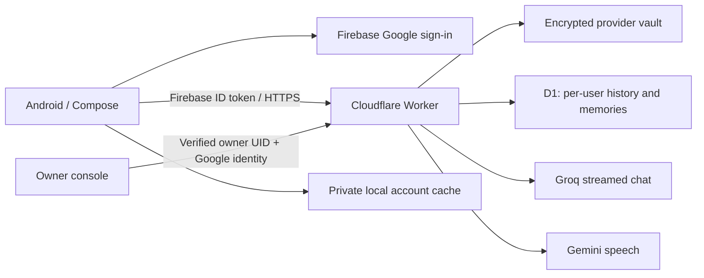

# KITTY AI

A native Kotlin + Jetpack Compose companion created by **Virat with the help of Kitty Corp**. Android package: `com.kitty.ai`.

The complete source includes the Android app, Cloudflare Worker API, D1 migrations, a separate owner console, premium brand artwork, security tests and release scripts.

**Start with [the beginner guide](docs/BEGINNER-GUIDE.md).** Read [the validation report](docs/VALIDATION.md) before treating a build as production-ready. This project does not embed provider keys in the Android app.

[Download KITTY AI 1.0.1](https://kitty-ai-v2.kitty-ai.workers.dev/downloads/KITTY-AI-1.0.1.apk) · [Owner console](https://kitty-ai-v2.kitty-ai.workers.dev) · [Deployment status](docs/DEPLOYMENT.md). The signed release is connected to the deployed backend. Firebase Google login, authorized domain, release fingerprints and exact owner UID are configured. Provider keys are intentionally left for the owner to add later; chat remains paused until then.

## Architecture

Firebase provides Authentication only; D1 is the selected backend for history and memory. No Firestore, Cloud Functions, Firebase Storage, phone-control APIs, microphone or background notifications are required.

## Source layout

- `android/`: app, data repository, account-scoped cache, Google login, streaming and audio, Compose screens.
- `backend/`: token verification and revocation checks, encrypted keys, quotas, idempotent replies, consent and owner routes.
- `admin/`: owner console served on the Worker’s own domain.
- `assets/brand/`: original KITTY icon.
- `scripts/`: tool setup, Firebase validation, account connection, deployment and APK builds.
- `docs/`: setup, operations and truthful validation.

## Development

Use Node 22.12+ and Java 17. Run `npm ci`, `npm run check`, `npm test`, then `npm run build`. Build the admin before `npm run dev`; Wrangler serves it and the API from the same origin. Copy `backend/.dev.vars.example` to `.dev.vars` only for local development. Production credentials belong in Cloudflare Worker Secrets.

On Windows, run `./scripts/install-android-tools.ps1`, then `./scripts/build-android.ps1`. Alternatively open `android/` in Android Studio, use its SDK and supply the validated `android/app/google-services.json`.

## Important boundaries

An APK build is not evidence of a working production account, model call, Google sign-in or device installation. Those depend on account setup and the checks documented in the validation report. A core prompt can guide a model’s identity, but cannot guarantee perfect resistance to model prompt injection. Credentials and backend authorization never depend on model obedience.

Saving conversations, reviewing examples and fine-tuning are separate processes. No model training job is included or claimed.
